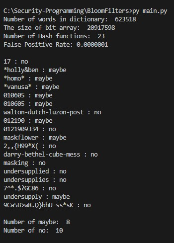

## Bloom Filters
To familiarize you with Bloom Filter and its use for detecting weak password selection. You should be able to select the appropriate design parameters for Bloom Filters needed for weak password detection given a set of bad passwords.
### Instruction
To write a program implementing a Bloom Filter.
### Dictionary text file and input text file
line 102 and 103 in main.py, rewrite the name of files for yours
```c
dictionary_file_name = "dictionary.txt"
input_file_name = "sample_input.txt"
```
### Install libraly:
```sh
pip3 install -r requirements.txt
```
### Command for running program
```sh
python3 main.py
```
### Result




