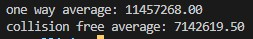

## Weak versus Strong Collision Resistance Property
Investigate the difference between hash function’s two properties: weak
collision resistance property versus strong collision-resistance property.
### Instruction
Use the brute-force method to see how long it takes to break each of these properties. Since most of the hash functions are quite strong against the brute-force attack on those two
properties, it will take us years to break them using the brute-force method. To make the task
feasible, you reduce the length of the hash value to 24 bits. We can use any one-way hash
function, but you only use the first 24 bits of the hash value in this task. Namely, you are using a modified one-way hash function.

### Command for running program
```sh
make all
./collision.exe
```
### Result


