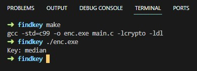

## Encrypting with OpenSSL
Learn how to use OpenSSL’s crypto library to encrypt/decrypt
messages in programs.
### Instruction
You are given a plaintext and a ciphertext, and you know that aes-128-cbc is used to generate
the ciphertext from the plaintext, and you also know that the numbers in the IV are all zeros
(not the ASCII character ‘0’). Another clue that you have learned is that the key used to encrypt
this plaintext is an English word shorter than 16 characters; the word that can be found from a
typical English dictionary. Since the word has less than 16 characters (i.e. 128 bits), space
characters (hexadecimal value 0x20) are appended to the end of the word to form a key of 128
bits. Your goal is to write a program to find out this key.
```
Plaintext (total 21 characters): This is a top secret.
Ciphertext (in hex format): 8d20e5056a8d24d0462ce74e4904c1b513e10d1df4a2ef2ad4540fae1ca0aaf9
```
### Command for running program
```sh
make all
./enc.exe
```
### Result


