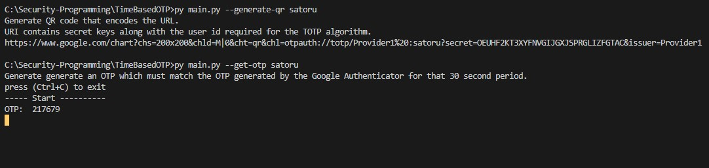
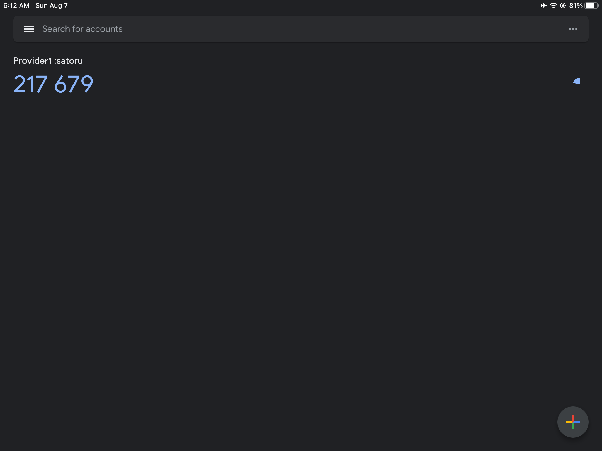

## one-time password
To get familiar with one-time password (OTP) protocols in current use. You should be able to use libraries to write programs to generate one-time passwords that can work with existing implementation such as the Google Authenticator App.
### Instruction
Build an application that can work with Google Authenticator (GA). GA uses a Time-Based One Time Password (TOTP) algorithm to generate One Time Passwords (OTPs) which you can use as a potential 2nd factor authentication method.

The specification for TOTP algorithm is defined in RFC 6238. RFCs are documents from Internet Engineering Task Force (ITEF) which is a large open international community of network designers, operators, vendors, and researchers concerned with the evolution of the Internet architecture and the smooth operation of the Internet.

Google authenticator supports different kinds of OTP algorithms, and you are going to implement 30-Second TOTP codes.

As a part of this program, you have to build an application that can generate QR codes which are readable by Google Authenticator Android App.

### To generate a jpg picture of the QR code that encodes the URL GA expects.
```sh
python main.py --generate-qr [userID]
```

### To generate an OTP which must match the OTP generated by the Google Authenticator for that 30 second period and print it to the screen
```sh
python main.py --get-otp [userID]
```
(userID is optional argument)

### Simple test
1. Generate QR code.
2. Use Google Authenticator to read QR code
3. Run command to generate an OTP when Google Authenticator generates new OTP.
4. Google Authenticator and my program must disuplay the same 6 digits of OTP.

### Result





### References
To generate URL for QR code

https://github.com/google/google-authenticator/wiki/Key-Uri-Format

https://stackoverflow.com/questions/34520928/how-to-generate-a-qr-code-for-google-authenticator-that-correctly-shows-issuer-d

https://grantwinney.com/how-to-create-a-2fa-code-for-your-app/

To generate OTP

https://github.com/susam/mintotp#with-base32-key

https://pypi.org/project/authenticator/

https://stackoverflow.com/questions/8529265/google-authenticator-implementation-in-python

To implement TOTP

https://datatracker.ietf.org/doc/html/rfc6238#page-4

To implement HOTP

https://datatracker.ietf.org/doc/html/rfc4226#page-5

More sources are on my code.